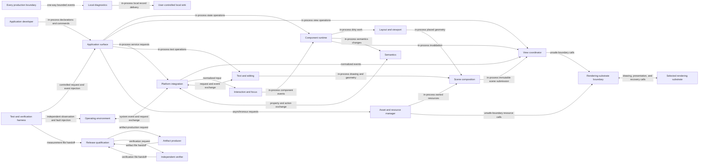
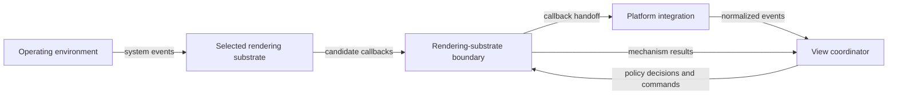

# Logical boundaries

The file name remains `containers.md` for pipeline stability. Oxyflut is primarily an in-process software development kit, so most boundaries are modules rather than independently deployed services.

## Boundary catalog

| Boundary | Kind | Logical type | Responsibility | Inputs and outputs | Depends on |
| :-- | :-- | :-- | :-- | :-- | :-- |
| Application surface | Module | Library surface | Expose safe composition, drawing, text, view, and service operations to the application developer. | Application declarations and commands in; owned handles, results, and structured errors out. | Component runtime, view coordinator, operating-environment services. |
| Component runtime | Module | State and lifecycle domain | Own reactive state, derived values, effects, batching, component identity, reconciliation, and teardown. | State changes and component declarations in; dirty layout, paint, and semantics work out. | Layout and viewport, scene composition, semantics, view coordinator. |
| Layout and viewport | Module | Spatial-computation domain | Resolve constraints, custom layout, virtualized visibility, scrolling state, and text-dependent geometry requests. | Constraints, component geometry, and scroll input in; placed geometry and visible ranges out. | Text and editing, scene composition. |
| Interaction and focus | Module | Input domain | Normalize hit-test candidates, resolve gestures, route keyboard input, and own focus scopes and traversal. | Normalized input and geometry in; component events, focus changes, and invalidations out. | Platform integration, layout and viewport, component runtime. |
| Text and editing | Module | Text domain | Own styled text, runtime font registration, editing state, selection geometry, composition, clipboard behavior, locale, and direction. | Text spans, fonts, editing commands, and platform text events in; geometry, drawing records, editing updates, and platform requests out. | Asset and resource manager, platform integration, scene composition. |
| Semantics | Module | Accessibility domain | Build each view's incremental semantics tree and route actions to live nodes. | Component semantics and view geometry in; platform properties, relations, and action results out. | Component runtime, layout and viewport, platform integration. |
| Scene composition | Module | Rendering domain | Record safe drawing commands and retained compositing state without exposing substrate handles. | Placed components, text, pictures, textures, and damage in; immutable scene submission out. | Layout and viewport, text and editing, asset and resource manager, rendering-substrate boundary. |
| Asset and resource manager | Module | Resource domain | Load assets asynchronously, decode images, cache reusable resources, realize textures, and enforce lifetime and memory limits. | Asset requests and cancellation in; owned decoded data, textures, completion events, and errors out. | Rendering-substrate boundary, local diagnostics. |
| View coordinator | Module | Scheduler and lifecycle domain | Own canonical per-view metrics, display epochs, presentation policy, invalidation, frame state, recovery policy, and interpretation of feedback. | Normalized lifecycle, timing, and feedback events plus runtime invalidations in; frame, submission, and recovery commands out. | Platform integration, component runtime, scene composition, rendering-substrate boundary. |
| Platform integration | Module | Operating-environment boundary | Serialize and normalize windows, displays, input, text, clipboard, accessibility, dialogs, lifecycle, and presentation callbacks from either allocation. | Operating-environment or candidate-transported events and application service requests in; canonical events and service results out. | Operating environment, selected rendering substrate, view coordinator, interaction and focus, text and editing, semantics. |
| Rendering-substrate boundary | Module with unsafe boundary | Rendering and presentation port | Execute candidate-specific drawing, text-resource, surface, submission, presentation, recovery, and teardown mechanisms without owning canonical product policy. | Scenes, resources, surfaces, frame parameters, and recovery commands in; mechanism completion, candidate callbacks, pixels, and structured errors out. | Selected rendering substrate. |
| Local diagnostics | Module | Observability domain | Emit versioned, bounded, privacy-classified records to user-controlled machine-local sinks. | Events, counters, identifiers, and timing in; local records and dropped-record counts out. | Every production boundary as an event source. |
| Test and verification harness | Process and module set | Qualification driver | Drive deterministic time and input, observe independent timing, inject faults, compare output, and preserve raw evidence. | Frozen scenarios and candidate artifacts in; measurements, comparisons, and failure evidence out. | Every public logical contract and operating environment. |
| Release qualification | Pipeline boundary | Governance plane | Build, inspect, verify, score, and admit substrate candidates and Tier 1 release artifacts. | Source revisions, artifacts, measurements, security evidence, and license evidence in; eligibility and selection records out. | Test and verification harness, artifact producer, independent verifier. |

Each boundary hides a distinct source of complexity. Removing one would disperse its ownership, invariants, or platform translation across unrelated modules rather than remove pass-through code. The View coordinator owns policy and state; the Rendering-substrate boundary performs mechanisms; Platform integration normalizes all operating-environment callbacks exactly once.

## External entities

| Entity | Role | Trust posture |
| :-- | :-- | :-- |
| Operating environment | Supplies windows, displays, services, events, and presentation feedback. | External and validated at Platform integration. |
| Selected rendering substrate | Performs the candidate's rendering and delegated platform mechanisms. | Unsafe external dependency contained by the Rendering-substrate boundary. |
| User-controlled local sink | Receives privacy-classified local diagnostic records. | Outside diagnostic buffers but inside the declared machine-local trust boundary. |
| Artifact producer | Produces candidate and release artifacts from frozen inputs. | Untrusted until Release qualification verifies identity, provenance, and content. |
| Independent verifier | Rebuilds or validates artifacts and metadata. | Separate qualification actor whose evidence is preserved. |

## Structure

## Candidate responsibility allocation

The logical boundaries don't change between substrate candidates. The following matrix separates canonical ownership from delegated mechanisms:

| Concern | Canonical owner | Focused drawing-and-text allocation | Integrated allocation |
| :-- | :-- | :-- | :-- |
| Operating-environment callback serialization | Platform integration | Receives callbacks directly. | Receives candidate callbacks and normalizes them before product logic. |
| Presentation-opportunity policy | View coordinator | Consumes timing from Platform integration and commands the candidate. | Consumes normalized candidate timing and commands the candidate's frame mechanism. |
| Scene and resource submission | Scene composition and Asset and resource manager | Calls focused candidate mechanisms. | Calls integrated candidate mechanisms through the same ownership contract. |
| Presentation feedback | View coordinator | Receives normalized operating-environment feedback. | Receives normalized candidate-transported feedback. |
| Recovery decision and attempt cap | View coordinator | Commands focused surface or device mechanisms. | Commands integrated recovery mechanisms. |
| Resource recreation and release | Rendering-substrate boundary | Executes focused resource mechanisms. | Executes integrated resource mechanisms. |
| System service routing | Platform integration | Calls the operating environment directly. | Uses direct or candidate transport, then normalizes one result. |
| Teardown order | View coordinator | Stops views, drains callbacks, and releases candidate resources. | Stops views, disables candidate callbacks, drains work, and releases integrated resources. |
| Secondary application runtime | Release qualification | Must be absent from production. | Must be absent from production even when transport mechanisms are retained. |

### Focused allocation view

### Integrated allocation view

In both allocations, callback normalization happens before product state changes. Candidate callbacks cannot mutate the Component runtime, View coordinator, Text and editing, or Semantics boundaries directly.

A cross-candidate hybrid across Tier 1 environments isn't part of this architecture. Such a split would create two production qualification and maintenance contracts and requires a Stage 1 Evolution pass followed by architecture revision.

## Logical execution domains

The host event-loop domain serializes operating-environment and candidate callbacks in Platform integration. If a callback arrives during a product-state mutation, Platform integration queues the normalized event instead of reentering the owner.

The application domain owns component, layout, interaction, text, semantics, scene, and View coordinator policy. The asynchronous worker domain performs cancelable asset loading and decoding with owner identities. The graphics-affine domain performs substrate resource, submission, presentation, recovery, and release mechanisms. Only owned commands and immutable data cross into worker or graphics-affine domains.

Teardown marks the application runtime or view as closing, rejects new work, disables or detaches external callbacks, cancels worker jobs, drains or rejects late completions, releases graphics-affine resources, and then removes canonical state. Allocation failure evicts eligible cache entries, coalesces optional work, and returns a structured error before violating a memory cap.
