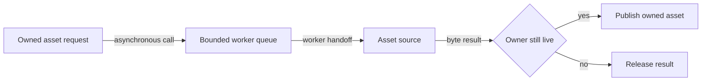

# Asynchronous asset loading flow

## Mapping

`CAP-AST-001`: When an application requests an asset, the system must load it asynchronously without blocking interactive processing.

## Behavior

## Failure path

If the queue is full, the source fails, a cap is exceeded, or the owner closes, Asset and resource manager returns a structured error or cancellation without blocking frame processing.
