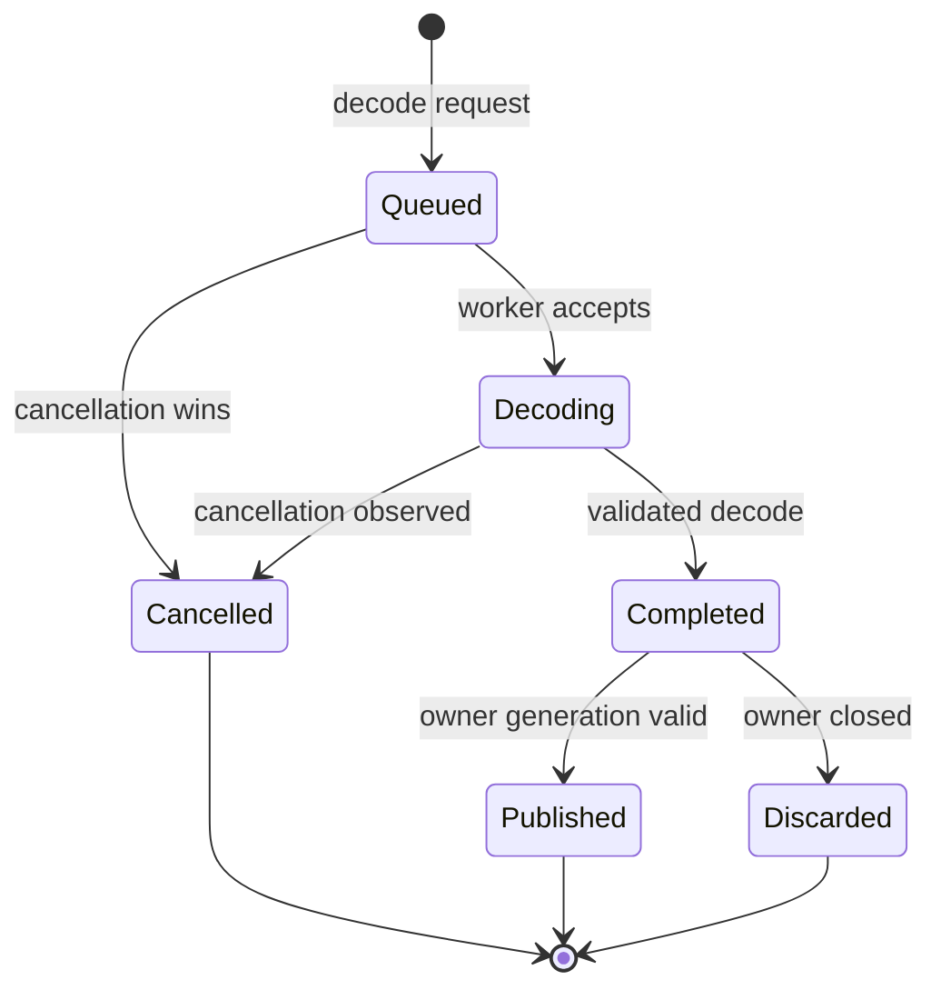

# Cancelable image decoding flow

## Mapping

`CAP-AST-002`: When an application requests image decoding, the system must perform the work asynchronously and permit cancellation.

## Behavior

## Failure path

Malformed input, resource-cap failure, and cancellation are distinct outcomes. None publishes partial decoded data.
