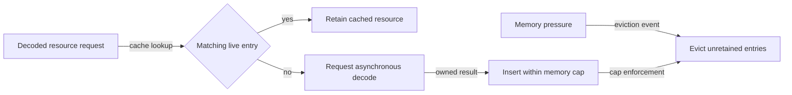

# Decoded resource caching flow

## Mapping

`CAP-AST-003`: The system must cache reusable decoded resources within declared memory limits.

## Behavior

## Failure path

If no eligible entry can be evicted within the memory cap, the cache rejects insertion and returns the owned decoded result or a structured allocation error.
