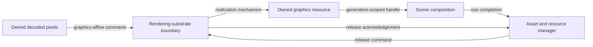

# Graphics resource realization flow

## Mapping

`CAP-AST-004`: The system must realize decoded pixels as graphics resources and preserve ownership through upload, use, and teardown.

## Behavior

## Failure path

If realization, submission, or release fails, the manager preserves ownership, prevents stale publication, and reports the failed stage without leaking a graphics resource.
