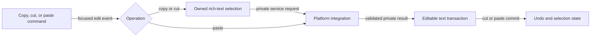

# Clipboard editing flow

## Mapping

`CAP-CLP-001`: The system must provide copy, cut, and paste while preserving rich-text selection behavior and private-content boundaries.

## Behavior

## Failure path

If focus, permission, content size, format, or selection generation is invalid, the operation leaves text and clipboard ownership unchanged and records no raw content.
