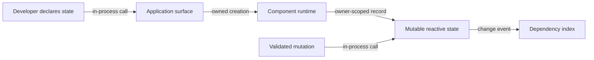

# Mutable reactive state flow

## Mapping

`CAP-CMP-001`: The system must let application developers define mutable reactive state.

## Behavior

## Failure path

If creation or mutation lacks a live owner, Component runtime rejects it and does not publish a change.
