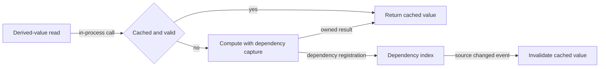

# Derived reactive value flow

## Mapping

`CAP-CMP-002`: The system must derive cached values from reactive dependencies.

## Behavior

## Failure path

If computation fails or forms a dependency cycle, Component runtime preserves the previous valid cache state and returns a structured derived-value error.
