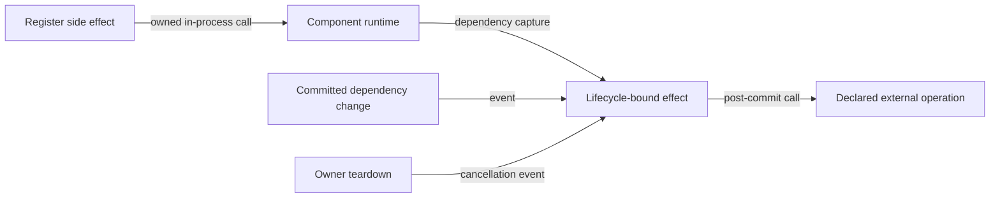

# Lifecycle-bound effect flow

## Mapping

`CAP-CMP-003`: The system must run lifecycle-bound side effects when their reactive dependencies change.

## Behavior

## Failure path

If an effect fails, reenters mutation, or runs after owner teardown, Component runtime contains the failure, rejects stale work, and preserves the committed state.
