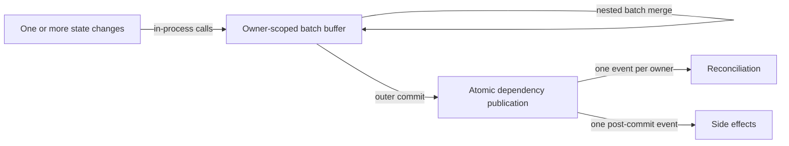

# Atomic state batch flow

## Mapping

`CAP-CMP-004`: When an application batches state changes, the system must publish their effects atomically and coalesce dependent work.

## Behavior

## Failure path

If a batched mutation fails, Component runtime cancels the uncommitted batch and publishes no intermediate state or dependent work.
