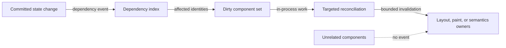

# Dependency-targeted update flow

## Mapping

`CAP-CMP-005`: When application state changes, the system must update only dependent parts of the component tree.

## Behavior

## Failure path

If dependency ownership is ambiguous, Component runtime fails the update instead of scanning or invalidating unrelated component subtrees.
