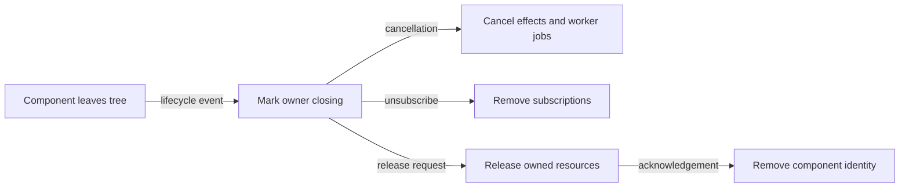

# Component teardown flow

## Mapping

`CAP-CMP-006`: When a component leaves the tree, the system must release its subscriptions and owned lifecycle resources.

## Behavior

## Failure path

If a completion arrives after closing begins, its generation check fails and teardown discards it. Teardown remains idempotent.
