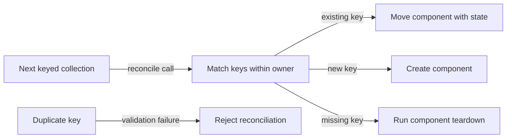

# Keyed component movement flow

## Mapping

`CAP-CMP-007`: When keyed components move within a dynamic collection, the system must preserve their state, focus, scroll position, and reusable render state.

## Behavior

## Failure path

If keys are duplicate or unstable within one owner, Component runtime rejects the reconciliation before moving state, focus, scroll position, or render state.
