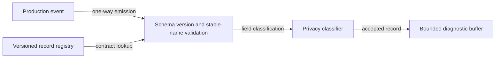

# Diagnostic record contract flow

## Mapping

`CAP-DIA-001`: The system must emit versioned local-diagnostic records with stable event names and field-level privacy classifications.

## Behavior

## Failure path

An unknown version, unstable name, or unclassified field is dropped before buffering and increments the contract-error counter.
