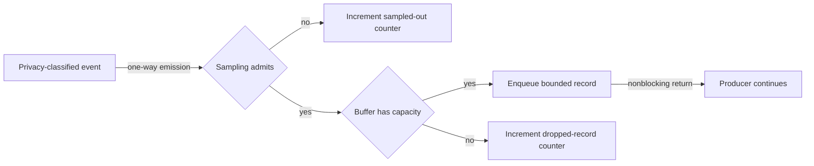

# Bounded diagnostic collection flow

## Mapping

`CAP-DIA-002`: The system must bound diagnostic buffers and sampling and must report dropped records.

## Behavior

## Failure path

Sampling or capacity rejection is an expected bounded outcome. It cannot block the producer or allocate beyond the frozen buffer cap.
