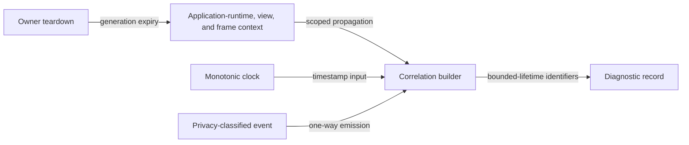

# Diagnostic correlation flow

## Mapping

`CAP-DIA-003`: The system must correlate diagnostic records on a monotonic clock with bounded-lifetime identifiers for each runtime, view, and frame.

## Behavior

## Failure path

If correlation context is missing, stale, or cross-runtime, Local diagnostics drops the record and increments a correlation-error counter.
