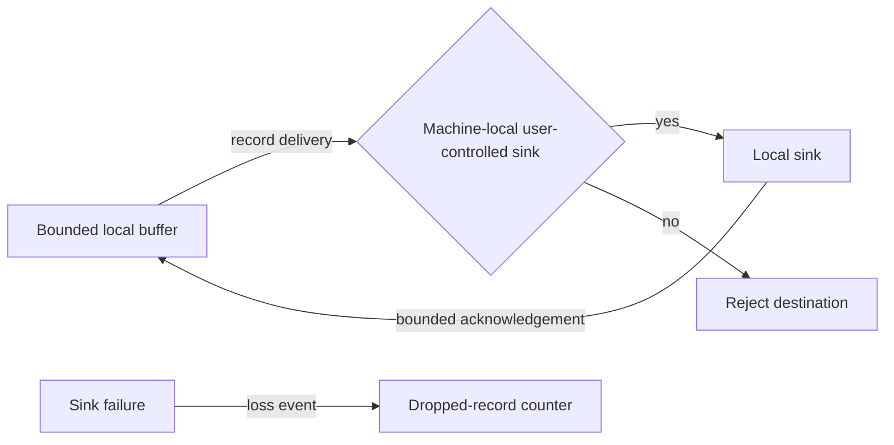

# Machine-local diagnostic sink flow

## Mapping

`CAP-DIA-004`: The system must expose diagnostic records only to machine-local, user-controlled sinks inside the application trust boundary.

## Behavior

## Failure path

A remote, undeclared, unavailable, or slow sink receives no records. Local diagnostics drops bounded work without returning failure to the production source.
