# Release artifact qualification flow

## Mapping

`CAP-DST-001`: The project must produce installable, signed, attributable, license-complete, and independently verifiable artifacts for every Tier 1 environment.

## Behavior

```mermaid
flowchart LR
    Source[Frozen source and dependencies] -->|build request| Producer[Artifact producer]
    Producer -->|unsigned artifact and metadata| Reproduce[Independent reproducibility check]
    Reproduce -->|matching verified content| Obligations[License, notice, and provenance admission]
    Obligations -->|admitted unsigned content| Sign[Environment signing and packaging]
    Sign -->|installable artifact| Verify[Independent per-environment verification]
    Verify -->|evidence file handoff| Gate[Release qualification]
```

## Failure path

A build, hash, reproducibility, attribution, license, provenance, signing, installation, or independent-verification failure rejects the artifact and its candidate.
