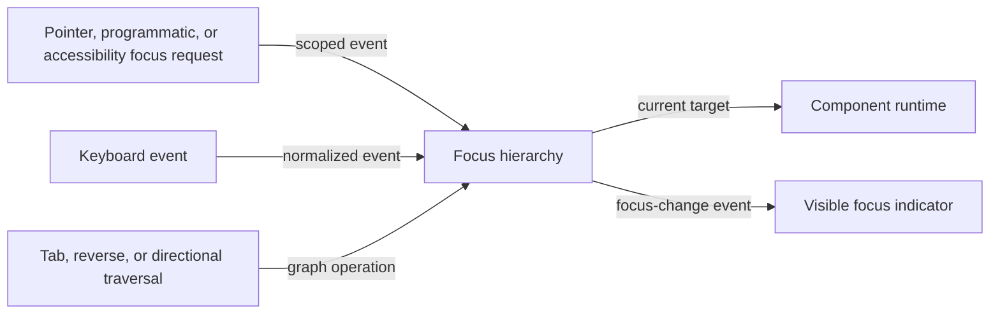

# Focus and keyboard flow

## Mapping

`CAP-FOC-001`: The system must provide focus scopes, keyboard routing and traversal, directional navigation, and visible focus indicators.

## Behavior

## Failure path

If a target is disabled, hidden, stale, or outside the active scope, Focus hierarchy rejects it or applies the frozen traversal fallback without routing the key elsewhere.
