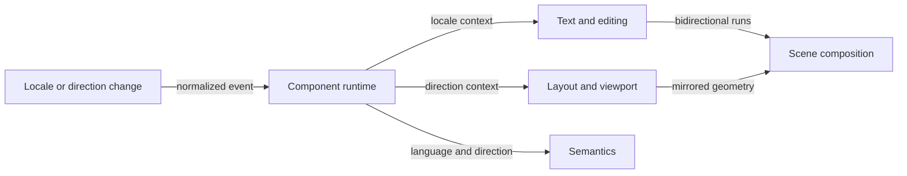

# Locale and direction flow

## Mapping

`CAP-I18N-001`: When locale or text direction changes, the system must propagate locale, render bidirectional text, and mirror directional layout where required.

## Behavior

## Failure path

If locale data or direction is invalid, the runtime retains the last valid context and doesn't publish a partially mirrored view.
