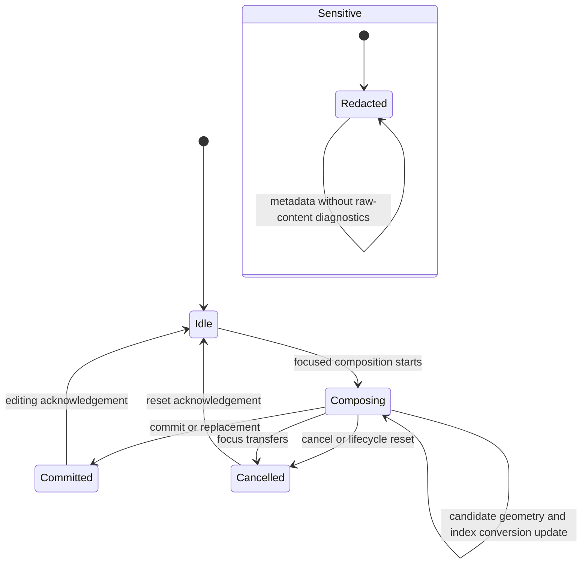

# Input method composition flow

## Mapping

`CAP-IME-001`: When the operating environment starts text composition, the system must preserve composition, candidate geometry, surrounding text, replacement, commit, cancellation, actions, metadata, index conversion, focus transfer, and sensitive-field behavior.

## Behavior

## Failure path

If transaction order, focus, index conversion, replacement range, or candidate geometry is invalid, Text and editing rejects the transaction and preserves the last acknowledged composition state.
