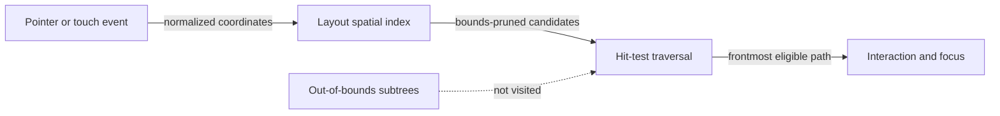

# Bounds-pruned hit-test flow

## Mapping

`CAP-INP-001`: The system must route pointer and touch input through bounds-pruned hit testing.

## Behavior

## Failure path

If coordinates, transforms, view identity, or tree generation are stale, Interaction and focus rejects the event rather than searching unrelated subtrees.
