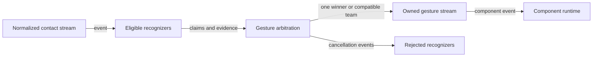

# Gesture disambiguation flow

## Mapping

`CAP-INP-002`: The system must resolve competing gestures through one deterministic disambiguation model.

## Behavior

## Failure path

If arbitration is ambiguous, an owner closes, or the stream violates ordering, the arena cancels all claims and emits no partial gesture.
