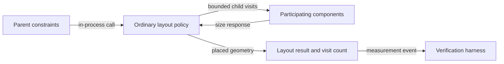

# Constraint propagation flow

## Mapping

`CAP-LAY-001`: The system must lay out components through bounded constraint propagation.

## Behavior

## Failure path

If constraints are invalid or a policy exceeds its declared visit cap, Layout and viewport rejects the result and records the gating layout failure.
