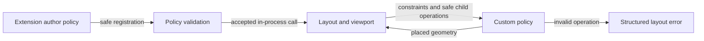

# Custom layout policy flow

## Mapping

`CAP-LAY-002`: The system must let extension authors define safe custom layout policies.

## Behavior

## Failure path

If a custom policy violates constraints, ownership, reentrancy, or its visit cap, Layout and viewport stops that policy without exposing substrate state.
