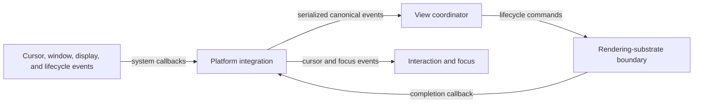

# Cursor and lifecycle integration flow

## Mapping

`CAP-OS-001`: The system must integrate required operating-system cursors and application lifecycle behavior without exposing unsafe substrate handles.

## Behavior

## Failure path

If callback order, identity, capability, or lifecycle state is invalid, Platform integration rejects the event and contains the failure to its view.
