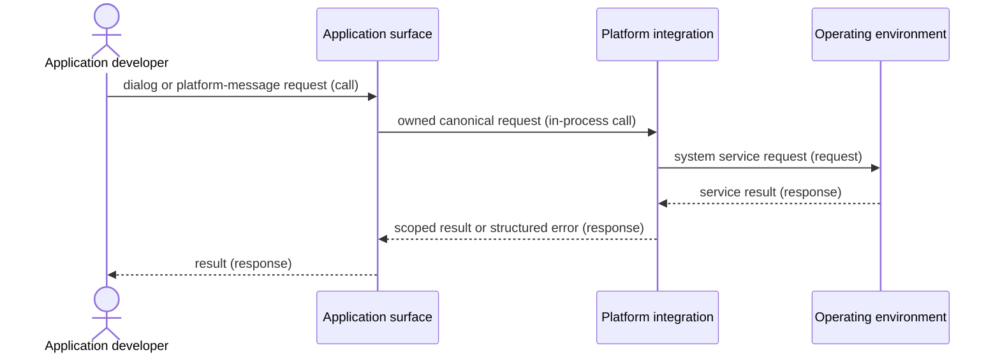

# Operating-system service flow

## Mapping

`CAP-OS-002`: The system must let applications invoke required operating-system services, including dialogs and platform messages, without exposing unsafe substrate handles.

## Behavior

## Failure path

If the owner closes, the response is oversized, or service routing is ambiguous, Platform integration rejects the result and doesn't deliver it to another view.
