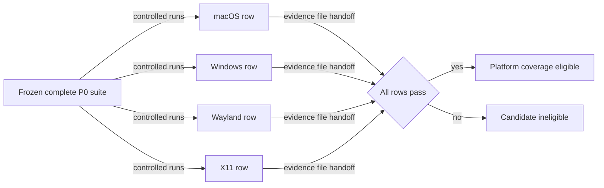

# Tier-one qualification flow

## Mapping

`CAP-PLT-001`: The system must satisfy every P0 capability on macOS, Windows, Wayland, and X11 before the first production release.

## Behavior

Tier 1 environments are qualified in the declared order: Wayland, X11, macOS, then Windows; the first production release waits for all four to pass.

## Failure path

A failed, missing, incomparable, or gating-known-unknown row makes the candidate ineligible. A cited unsupported event can be not applicable only under the frozen baseline.
