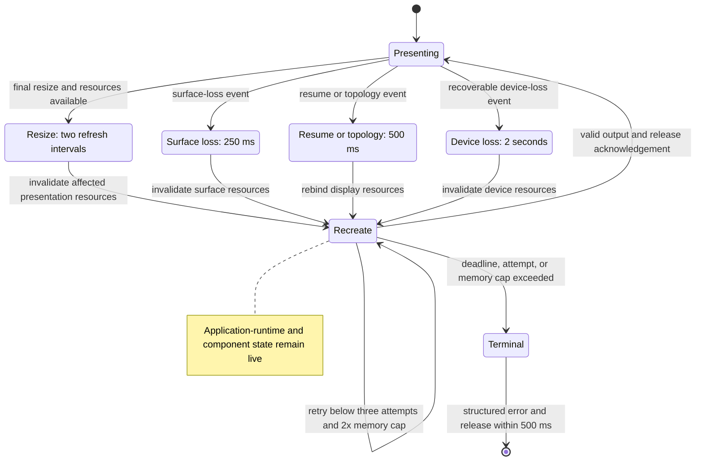

# Surface recovery flow

## Mapping

`CAP-REC-001`: When a recoverable presentation or graphics fault occurs, the system must restore valid output within the applicable recovery deadline and preserve framework state.

## Behavior

## Failure path

If any deadline, three-attempt cap, 2x transient-memory cap, or 500 ms superseded-resource release bound fails, View coordinator returns a structured terminal error and preserves the evidence.
