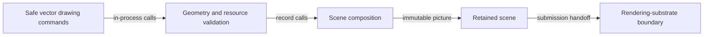

# Safe vector drawing flow

## Mapping

`CAP-REN-001`: The system must let extension authors record vector paths, shapes, gradients, transforms, clips, filters, images, and reusable pictures through the safe public surface.

## Behavior

## Failure path

If geometry, transforms, clips, filters, images, or ownership are invalid, Scene composition rejects the command and never emits a partial picture.
