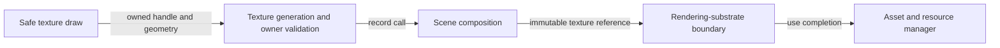

# Safe texture drawing flow

## Mapping

`CAP-REN-002`: The system must let extension authors draw realized textures through the safe public surface.

## Behavior

## Failure path

If the texture is stale, released, cross-runtime, or invalid for the scene, Scene composition rejects the draw before submission.
