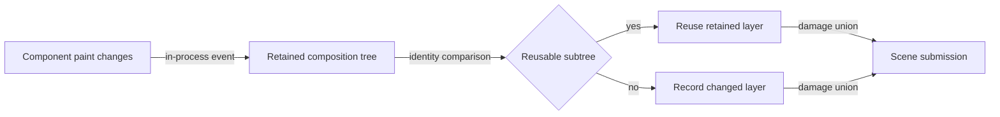

# Retained composition flow

## Mapping

`CAP-REN-003`: The system must retain compositing state for opacity, clipping, transforms, reusable subtrees, and effects that read existing scene content.

## Behavior

## Failure path

If layer identity, bounds, or effect ordering is invalid, Scene composition rebuilds the affected subtree or fails the scene without reusing ambiguous content.
