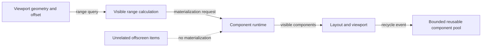

# Virtualized viewport flow

## Mapping

`CAP-SCR-001`: The system must create virtualized viewports whose work depends on visible content rather than total collection size.

## Behavior

## Failure path

If visibility can't be bounded or the reusable pool reaches its cap, Layout and viewport returns a structured resource error instead of materializing the full collection.
