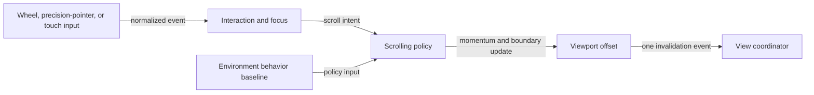

# Platform-appropriate scrolling flow

## Mapping

`CAP-SCR-002`: The system must provide platform-appropriate wheel, precision-pointer, touch, momentum, and boundary scrolling behavior.

## Behavior

## Failure path

If an event is stale, targets another view, or yields an invalid offset, the scrolling policy preserves the last valid position and cancels its momentum sequence.
