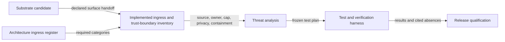

# Ingress threat qualification flow

## Mapping

`CAP-SEC-001`: Before qualification, the project must inventory each implemented external ingress and trust boundary and must define threats, payload limits, and mitigations for each one.

## Behavior

## Failure path

Any undeclared ingress, unjustified absence, missing owner, missing payload cap, unclassified private content, or untested mitigation keeps the candidate ineligible.
