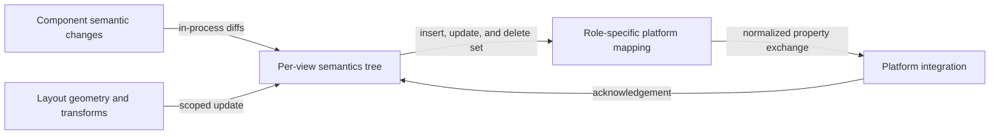

# Incremental semantics flow

## Mapping

`CAP-SEM-001`: The system must maintain an incremental semantics tree that preserves every applicable role-specific property, relation, state, value, geometry, text range, traversal rule, and view identity.

## Behavior

## Failure path

If a diff has duplicate identities, invalid relationships, stale geometry, or an unmapped required property, Semantics rejects the affected update and preserves the last acknowledged tree.
