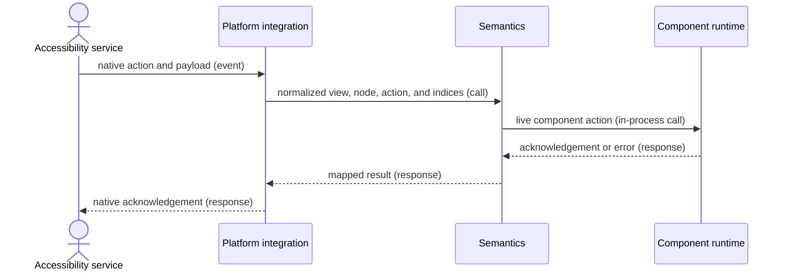

# Accessibility action flow

## Mapping

`CAP-SEM-002`: When an accessibility service invokes an action, the system must route its payload to the correct live view and semantics node and return a defined acknowledgement or stale-target error.

## Behavior

## Failure path

If the runtime, view, or node is stale or the payload is invalid, Semantics returns the defined stale-target or validation error and never retargets another node.
