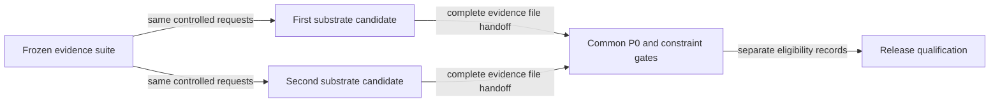

# Symmetric candidate qualification flow

## Mapping

`CAP-SUB-001`: Before selection, every substrate candidate must pass the same complete P0 capability set and every applicable safety, security, privacy, performance, recovery, diagnostics, distribution, licensing, provenance, and upgrade constraint under one frozen evidence suite.

## Behavior

## Failure path

Missing, candidate-specific, incomparable, failed, or unresolved gating evidence makes that candidate ineligible and cannot weaken the common suite.
