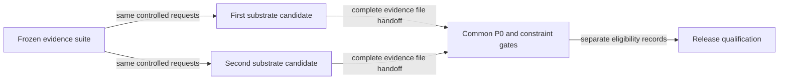

# Symmetric candidate qualification flow

## Mapping

`CAP-SUB-001`: Before selection, every substrate candidate must pass the same complete P0 capability set and every applicable safety, security, privacy, performance, recovery, diagnostics, distribution, licensing, provenance, and upgrade constraint under one frozen evidence suite.

## Behavior

## Sequencing

Substrate candidates enter the frozen suite in the declared order: the integrated candidate first, then the focused candidate only if the integrated candidate fails hard-gate eligibility on the first qualification environment.

## Failure path

Missing, candidate-specific, incomparable, failed, or unresolved gating evidence makes that candidate ineligible and cannot weaken the common suite. Evidence from a later Tier 1 environment that makes a provisional selection ineligible reverses the provisional selection and prevents final selection.
