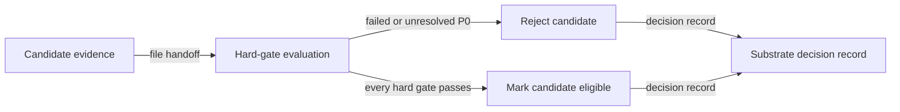

# Candidate rejection flow

## Mapping

`CAP-SUB-002`: The project must reject a substrate candidate that fails or retains an unresolved gating P0 item.

## Behavior

## Failure path

Release qualification records each failed or unresolved gate. It doesn't convert a plan, score, or inferred capability into eligibility.
