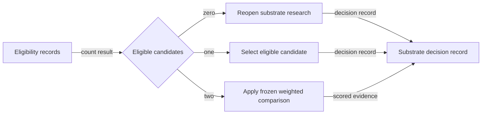

# Eligibility outcome flow

## Mapping

`CAP-SUB-003`: If zero candidates are eligible, the project must reopen substrate research; if one is eligible, it must select that candidate; if two are eligible, it must apply the frozen weighted comparison.

## Behavior

## Failure path

If candidate count or eligibility evidence is inconsistent, the selection remains open until Release qualification resolves the records.
