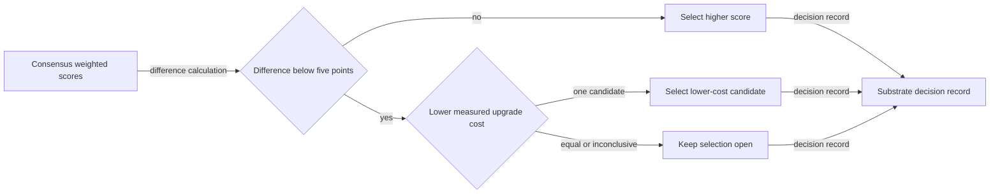

# Maintenance tie-break flow

## Mapping

`CAP-SUB-004`: If two eligible candidates differ by fewer than 5 weighted points, the project must select the candidate with lower measured upgrade-maintenance cost; equal or inconclusive evidence keeps the decision open.

## Behavior

## Failure path

Missing, equal, or inconclusive maintenance evidence cannot be guessed or resolved by another criterion; the substrate selection stays open.
