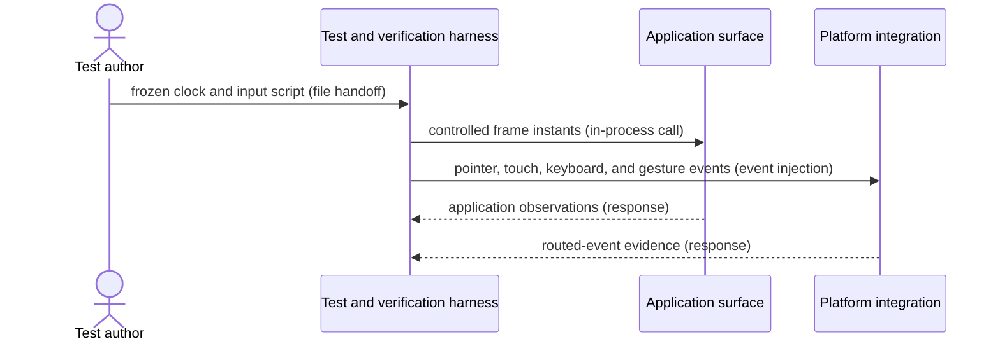

# Deterministic input harness flow

## Mapping

`CAP-TST-001`: The test harness must pump frames and simulate pointer, touch, keyboard, and gesture input deterministically.

## Behavior

## Failure path

If virtual time, input order, owner identity, or expected event count diverges, the harness preserves the trace and fails the deterministic scenario.
