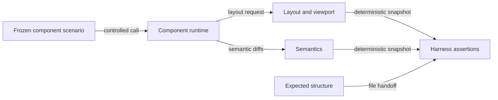

# Structural assertion flow

## Mapping

`CAP-TST-002`: The test harness must assert layout and semantics deterministically.

## Behavior

## Failure path

If either snapshot is missing, nondeterministic, or differs from its expected structure, the harness records the exact structural difference and fails the case.
