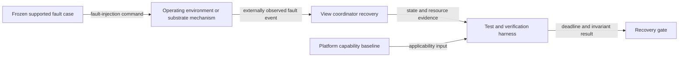

# Fault-injection flow

## Mapping

`CAP-TST-003`: The test harness must inject every supported recoverable lifecycle and graphics fault.

## Behavior

## Failure path

If the fault cannot be induced despite platform support, evidence is incomplete and remains gating. Unsupported events require cited baseline evidence.
