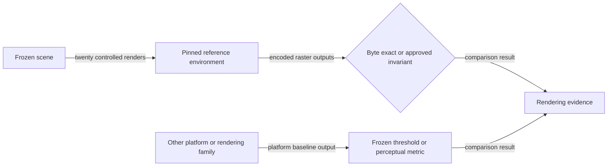

# Rendering comparison flow

## Mapping

`CAP-TST-004`: The test harness must compare rendered output under pinned environments and declared cross-environment metrics.

## Behavior

## Failure path

Any unapproved byte difference, invariant failure, threshold excess, unfrozen environment, or missing raw output fails the comparison.
