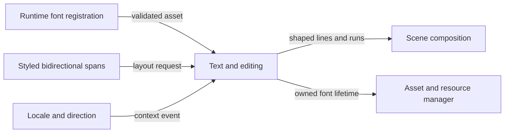

# Styled bidirectional text flow

## Mapping

`CAP-TXT-001`: The system must render styled bidirectional text from fonts registered at runtime.

## Behavior

## Failure path

If a font is malformed, released too early, or lacks a required fallback, Text and editing returns a structured text-layout error and doesn't publish partial runs.
