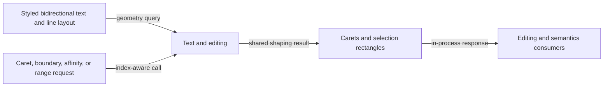

# Text geometry flow

## Mapping

`CAP-TXT-002`: The system must expose complete caret, boundary, range, affinity, and selection geometry for styled bidirectional text.

## Behavior

## Failure path

If an index splits an invalid unit, affinity is ambiguous, or layout generation is stale, Text and editing rejects the query instead of approximating geometry.
