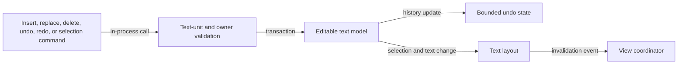

# Rich-text editing flow

## Mapping

`CAP-TXT-003`: The system must provide insertion, replacement, grapheme and word deletion, undo, redo, and keyboard and pointer selection for rich text.

## Behavior

## Failure path

If a command has stale selection, invalid text boundaries, or an unavailable history entry, the model preserves the prior text and selection and returns a structured error.
