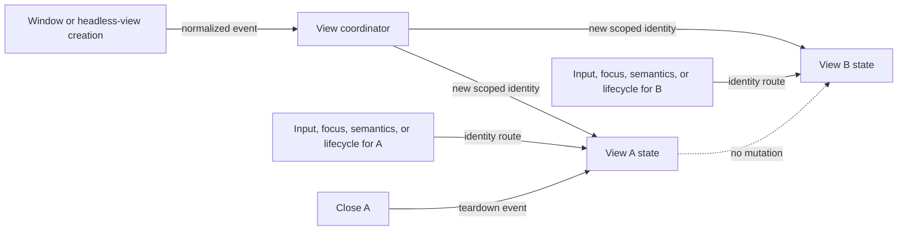

# Independent view lifecycle flow

## Mapping

`CAP-VIEW-001`: The system must operate multiple views with independent metrics, focus, input, semantics, invalidation, lifecycle, and teardown.

## Behavior

## Failure path

If an event or completion has a missing, stale, or cross-runtime view identity, View coordinator rejects it and doesn't infer a default view.
